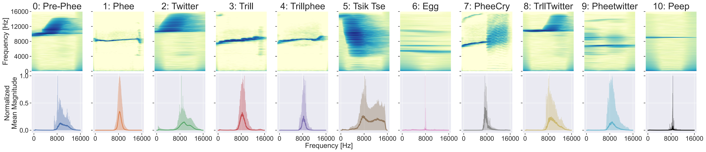

# On the Utility of Speech and Audio Foundation Models for Marmoset Call Analysis


[[Paper]](https://arxiv.org/abs/2407.16417)
[[Slides]](https://eklavyafcb.github.io/docs/Sarkar_Interspeech_2024_Presentation.pdf)

<p align="center">

[](https://github.com/pre-commit/pre-commit)
[](https://pytorch.org/get-started/locally/)
[](https://pytorchlightning.ai/)
[](https://hydra.cc/)
[](https://black.readthedocs.io/en/stable/)
[](https://pycqa.github.io/isort/)
[](https://github.com/idiap/speech-utility-bioacoustics/blob/main/LICENSE)
[](tps://github.com/speech-utility-bioacoustics/)
<br><br>


</p>

## Cite

This repository contains the source code for the **ISCA Interspeech 2024** paper [On the Utility of Speech and Audio Foundation Models for Marmoset Call Analysis](https://vihar-2024.vihar.org/proceedings/) by E. Sarkar and M. Magimai Doss (2024). It was accepted at the _4th International Workshop on Vocal Interactivity in-and-between Humans, Animals and Robots (VIHAR 2024)_ workshop track.

Please cite the original authors for their work in any publication(s) that uses this work:

```bib
@inproceedings{sarkar24_vihar,
  title     = {On the Utility of Speech and Audio Foundation Models for Marmoset Call Analysis},
  author    = {Eklavya Sarkar and Mathew Magimai.-Doss},
  year      = {2024},
  booktitle = {4th International Workshop on Vocal Interactivity In-and-between Humans, Animals and Robots (VIHAR2024)},
  doi       = {10.5281/zenodo.13935495},
  isbn      = {978-2-9562029-3-6},
}
```

## Dataset

InfantMarmosetsVox is a dataset for multi-class call-type and caller identification. It contains audio recordings of different individual marmosets and their call-types. The dataset contains a total of 350 files of precisely labelled 10-minute audio recordings across all caller classes. The audio was recorded from five pairs of infant marmoset twins, each recorded individually in two separate sound-proofed recording rooms at a sampling rate of 44.1 kHz. The start and end time, call-type, and marmoset identity of each vocalization are provided, labeled by an experienced researcher. It contains a total of 169,318 labeled audio segments, which amounts to 72,921 vocalization segments once removing the "Silence" and "Noise" classes. There are 11 different call-types (excluding "Silence" and "Noise") and 10 different caller identities. 

The dataset is publicly available [here](https://www.idiap.ch/en/dataset/infantmarmosetsvox/index_html), and contains a usable Pytorch `Dataset` and `Dataloader`. Any publication (eg. conference paper, journal article, technical report, book chapter, etc) resulting from the usage of InfantsMarmosetVox **must cite** this [paper](https://www.isca-speech.org/archive/interspeech_2023/sarkar23_interspeech.html):

```bib
@inproceedings{sarkar23_interspeech,
  title     = {Can Self-Supervised Neural Representations Pre-Trained on Human Speech distinguish Animal Callers?},
  author    = {Eklavya Sarkar and Mathew Magimai.-Doss},
  year      = {2023},
  booktitle = {INTERSPEECH 2023},
  pages     = {1189--1193},
  doi       = {10.21437/Interspeech.2023-1968},
  issn      = {2958-1796},
}
```

More information on the usage is provided in the `README.txt` file of the dataset.

## Installation

This package has very few requirements. 
To create a new conda/mamba environment, install [conda](https://conda.io), then [mamba](https://mamba.readthedocs.io/en/latest/installation.html#existing-conda-install), and simply follow the next steps:

```bash
# Clone project
git clone https://github.com/idiap/speech-utility-bioacoustics
cd speech-utility-bioacoustics

# Create and activate environment
mamba env create -f environment.yml
mamba activate marmosets
```

## Usage
Train model with chosen experiment configuration from [configs/experiment/](configs/experiment/)

```bash
python src/train.py experiment=experiment_name.yaml
```

You can override any parameter from command line like this

```bash
python src/train.py trainer.max_epochs=20
```

## Experiments
The experiments conducted in this paper can be found in the [scripts](scripts) folder. These contain feature extraction, pairwise distance computation, and training scripts. 

Sample run:

```bash
$ ./scripts/train/wavlm.sh
```

These use [gridtk](https://pypi.org/project/gridtk/) but can be reconfigured according to the user's needs.

## Directory Structure

The structure of this directory is organized as the following:

```
.
├── CITATION.cff            # Setup
├── configs                 # Experiment configs
├── environment.yaml        # Environment file
├── hydra_plugins           # Plugins
├── img                     # Images
├── LICENSE                 # License
├── Makefile                # Setup
├── MANIFEST.in             # Setup
├── pyproject.toml          # Setup
├── README.md               # This file
├── requirements.txt        # Requirements
├── scripts                 # Scripts
├── setup.py                # Setup
├── src                     # Python source code
└── version.txt             # Version

```

## Contact

For questions or reporting issues to this software package, kindly contact the first [author](mailto:eklavya.sarkar@idiap.ch).
